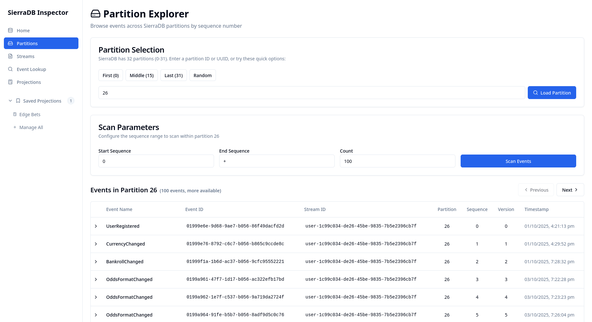
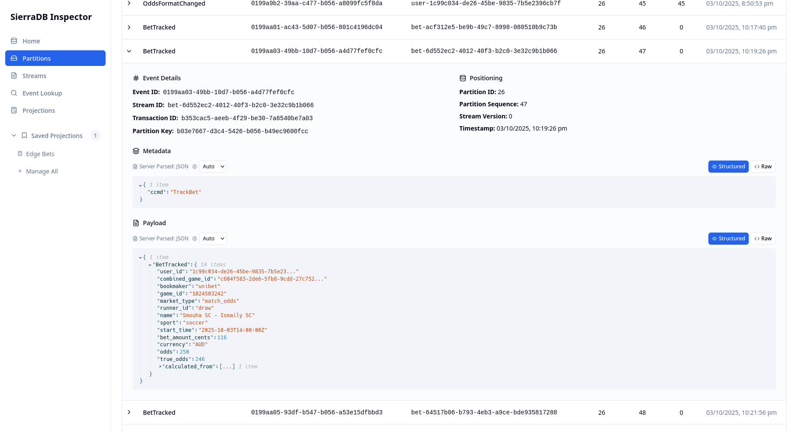
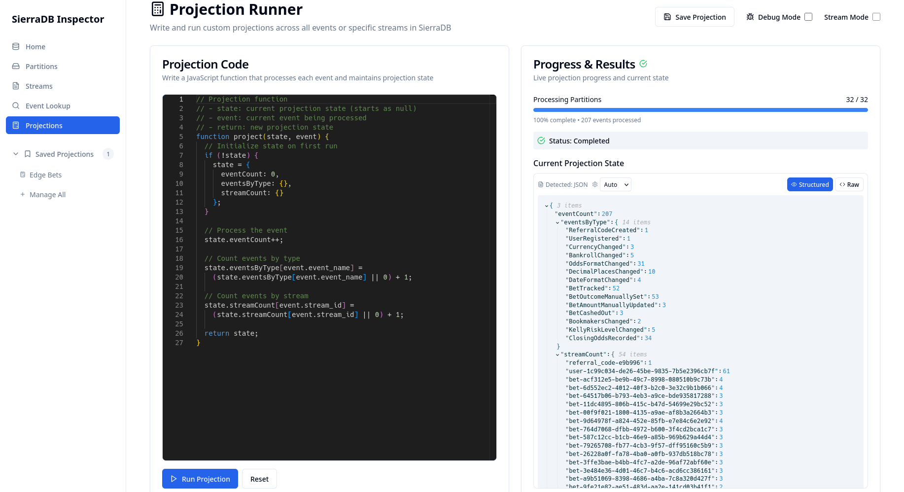

# SierraDB Inspector

A modern web interface for exploring events in SierraDB - a distributed event sourcing database built in Rust.

## Features

- **Partition Explorer** - Browse events across SierraDB's 1,024 logical partitions
- **Stream Explorer** - Navigate event streams by version numbers
- **Event Lookup** - Search for specific events by UUID
- **Projection Runner** - Execute JavaScript projections against event data
- **Real-time Connection Status** - Monitor SierraDB connectivity
- **Responsive Design** - Modern UI built with React and Tailwind CSS

## Screenshots

### Partition Explorer
Browse and explore events across partitions with a condensed table view:





### Projection Runner
Execute custom JavaScript projections to analyze event data:



## Architecture

This is a monorepo containing:

- **`client/`** - React frontend with TypeScript, Vite, and Tailwind CSS
- **`server/`** - Express.js backend with Redis client for SierraDB RESP3 protocol
- **`shared/`** - Common TypeScript types and utilities

## Prerequisites

- Node.js 18+ 
- SierraDB instance running on Redis protocol (default: `redis://localhost:9090`)

## Quick Start

### Option 1: Using Docker (Recommended)

```bash
docker run -p 3001:3001 -e SIERRADB_URL=redis://your-sierradb-host:9090 tqwewe/sierradb-inspector
```

Access the application at http://localhost:3001

### Option 2: Development Setup

1. **Install dependencies**
   ```bash
   npm install
   ```

2. **Start the development servers**
   ```bash
   # Start both client and server in development mode
   npm run dev
   ```

3. **Access the application**
   - Frontend: http://localhost:5173
   - Backend API: http://localhost:3001

## Environment Configuration

Create a `.env` file in the server directory to configure SierraDB connection:

```env
SIERRADB_URL=redis://localhost:9090
PORT=3001
```

## SierraDB Overview

SierraDB organizes data around:
- **1,024 logical partitions** for deterministic hashing and concurrency control
- **Streams** with monotonic, gapless version numbers
- **Events** with unique UUIDs and partition sequences
- **RESP3 protocol** for communication

## API Endpoints

- `GET /api/ping` - Test SierraDB connectivity
- `GET /api/events/:event_id` - Get event by UUID
- `GET /api/partitions/:partition/scan` - Scan partition events
- `GET /api/streams/:stream_id/scan` - Scan stream events

## Development

```bash
# Install dependencies
npm install

# Start development servers
npm run dev

# Build for production
npm run build

# Start production server
npm start
```

## License

This project is built for exploring SierraDB event data in a simple and intuitive way.
